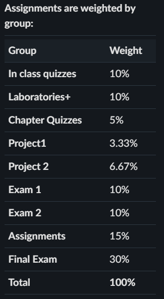
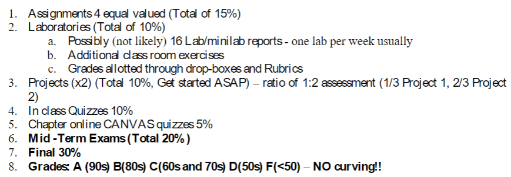

```{r setup, include=FALSE}
knitr::opts_chunk$set(echo = TRUE)
```

# Problem 1

**Assignment Weights**

{ width=70% }

**Final Grade**

{ width=70% }


# Problem 2
```{r}
ddt = read.csv("DDT.csv")
head(ddt)
m=with(ddt, as.numeric(factor(MILE))) # A
length(unique(m))
```

### a)

```{r}
fishcol=with(ddt,ifelse(SPECIES=="CCATFISH","Red",
                        ifelse(SPECIES=="SMBUFFALO","Blue","Green")))

#River col
rivcol=with(ddt, ifelse(RIVER=="FCM","Red",
                        ifelse(RIVER=="LCM","Blue",
                               ifelse(RIVER=="SCM","Green","Black"))))

coplot(LENGTH~WEIGHT|RIVER*SPECIES,data=ddt,col=fishcol)
```

### b)

* The lower left three plots are showing specific fish with the species of CCATFISH in the riversFCM, LCM, and SCM with their length(y-axis) and weight(x-axis)

### c)

**Line A**
Line A creates a numeric vector (vector in numeric order) of all of the mile values in ddt and stores it in variable m
`m=with(ddt, as.numeric(factor(MILE)))`

### d)

**Line B**
Line B returns the number of unique values in vector m given in line A
`length(unique(m))`

### e)

`There are no LMBASS or SMBUFFALO in rivers FCM, LCM, or SCM as shown below.`

```{r}
ddt[ddt$RIVER=="FCM" & ddt$SPECIES=="LMBASS",]
ddt[ddt$RIVER=="FCM" & ddt$SPECIES=="SMBUFFALO",]
ddt[ddt$RIVER=="LCM" & ddt$SPECIES=="LMBASS",]
ddt[ddt$RIVER=="LCM" & ddt$SPECIES=="SMBUFFALO",]
ddt[ddt$RIVER=="SCM" & ddt$SPECIES=="LMBASS",]
ddt[ddt$RIVER=="SCM" & ddt$SPECIES=="SMBUFFALO",]
```

### f)

```{r}
catfish=ddt[ddt$RIVER=="FCM" & ddt$SPECIES=="CCATFISH",]
mean(catfish$DDT)

```


# Problem 3

# Problem 4

# Problem 5

# Problem 6

# Problem 7

# Problem 8

# Problem 9

# Problem 10

# Problem 11

# Problem 12

# Problem 13

# Problem 14 

# Problem 15

